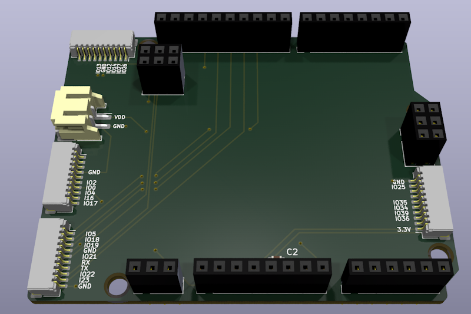
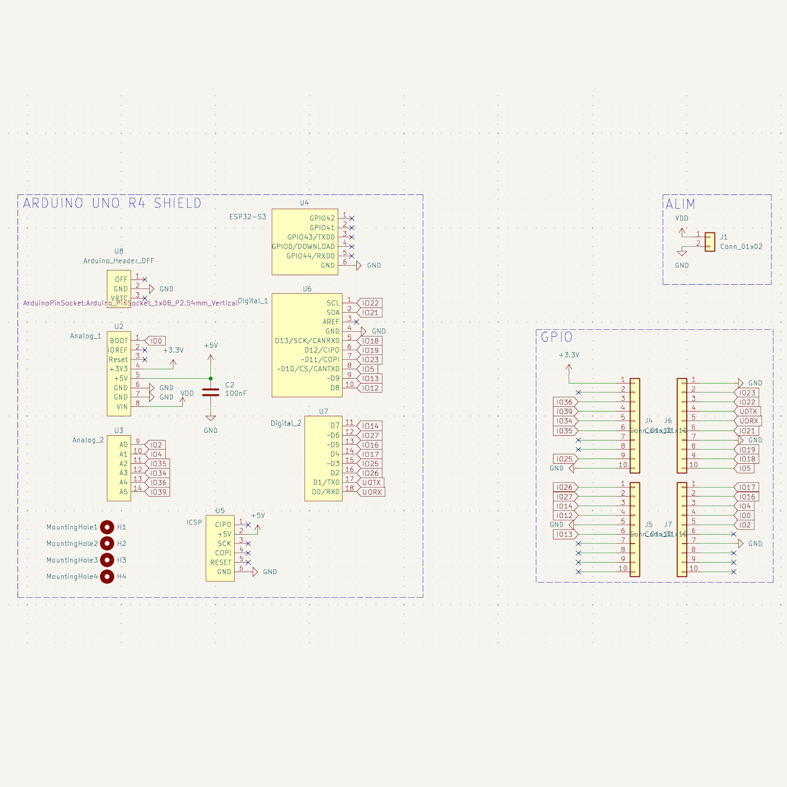
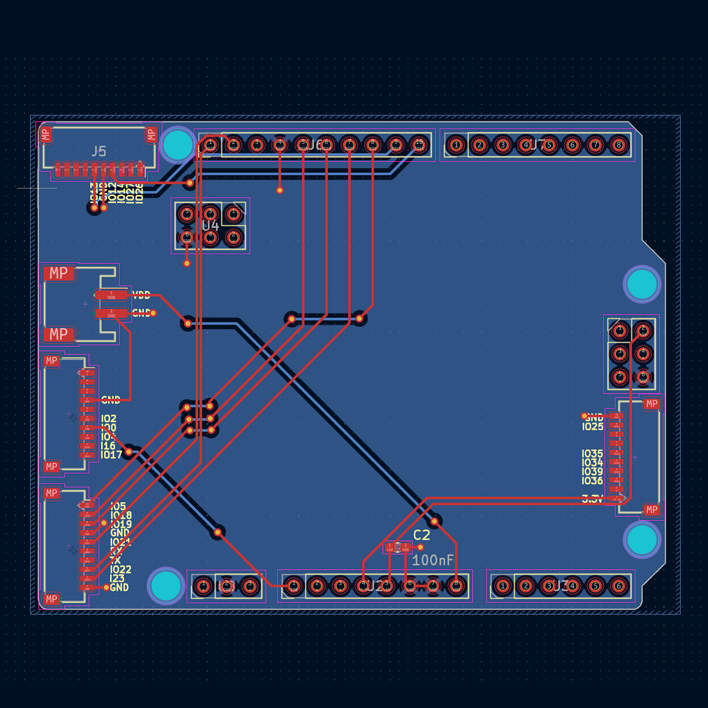
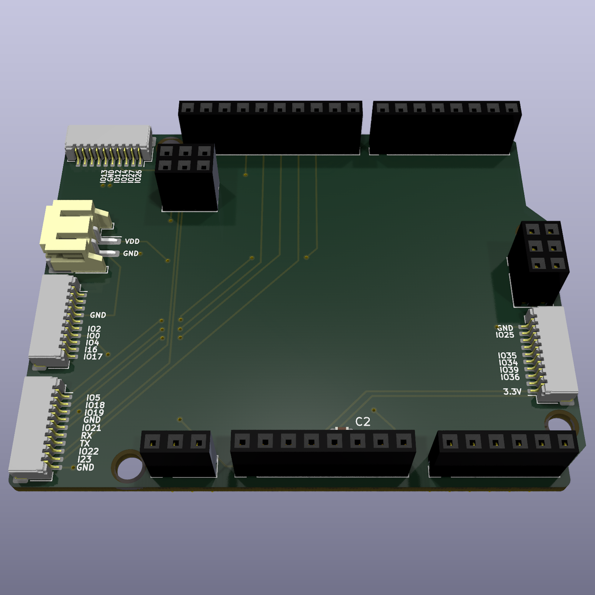

# D1R32InterfaceShield 
# 🔌 Modular JST Shield for UNO D1 R32  

## 🚀 Overview  
  

**D1R32InterfaceShield** is an open-source PCB that provides a reliable, modular interface between the **UNO D1 R32 Board Module** and various external modules via **JST-SM & JST-SH connectors**. It simplifies integration for IoT, automation, and embedded applications.  

## 🎯 Purpose  

- 🔌 **Modular Interface**: Bridges the UNO D1 R32 with sensors, actuators, and peripherals.  
- 📏 **Compact Design**: Optimized layout for small enclosures and prototypes.  
- 🛠️ **Open-source Hardware**: Fully customizable to match your project requirements.  

## 📝 Features  

| 🏷️ Feature                | 🔍 Description                                                 |
|---------------------------|---------------------------------------------------------------|
| 🔌 **Board Compatibility** | Fits the UNO D1 R32 Board Module                              |
| 📡 **Connectors**          | JST-SM & JST-SH for quick, secure connections                 |
| ⚡ **Power Handling**       | Supports 3.3V and 5V logic                                    |
| 🛠️ **GPIO Access**        | Breaks out key digital and analog pins for peripherals         |
| 🔧 **Stability Components**| Includes capacitors for signal conditioning                   |
| 🖥️ **PCB Design**         | Open-source and easy to modify                                 |
| 🌍 **Use Cases**           | IoT, automation, robotics, prototyping                         |

## 📐 PCB Design Preview  
| 📜 Schematic | 🖥️ PCB Layout | 🏗️ 3D |
|--------------|---------------|-------|
|  |  |  |

## 🌟 License  

This project is open-source. Use, modify, and contribute freely. 🚀

